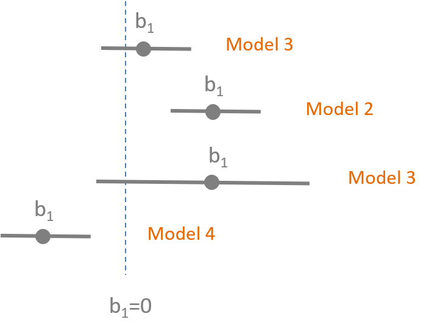
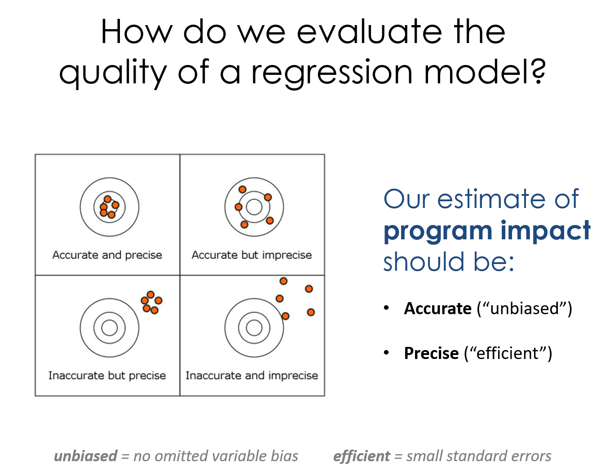

 
<!--- 
New sections start with 2 stars:  ** Section Title
New units start with 3 stars:     *** {Unit Metadata}
-----------------------------start example
** Section-I
*** { @unit = "15th Nov", @title = "Course Overview", @reading, @lecture, @assignment, @foldout }
-----------------------------end example
Unit Metadata is comprised of:
@unit - date or number
@title - unit name
@reading - turn on reading icon
@assignment - turn on lecture icon
@lecture - turn on lecture icon
@foldout - activate unit content (allow foldout)
Submit Button - <a class="uk-button uk-button-primary" href="{{page.canvas.assignment_url}}">Submit Lab</a>
-->

<style> 
body {
   font-family: "Roboto", sans-serif;
}
 
p.italic {
  font-style: italic;
  color: black !important;
}
td {
  text-align: left;
}
td.i {
  text-align: center;
}
iframe {
  align: middle;
}
em {
  color: black !important;
}
article {
  padding-left:20%;
}
</style>


** Review


*** { @unit = "", @title = "Overview of the Program Evaluation", @lecture, @foldout  }

<br>
<br>

## Evidence-Based Practices 

 

What does it mean to live in an evidence-based world? How do we become more data-driven? 

It turns out that using data to improve decision-making and organizatoinal performance is not a trivial affair because of a little problem called omitted variable bias (correlation does not equal causation). As a result, we need to combine judicious analytical techniques with feasible approaches to research design in order to understand **causal impact** of social programs. 

Here is a great introduction to a case study that uses evaluation to better understant the impact of a government program by getting past anecdotes to measure program impact.

<br>

<iframe width="560" height="315" src="https://www.youtube.com/embed/N8rD844McrA" frameborder="0" allow="accelerometer; autoplay; encrypted-media; gyroscope; picture-in-picture" allowfullscreen></iframe>

<br>
<br>


## Understanding Causal Impact Without Randomized Control Trials

In most cases we don't have resources for large-scale Randomized Control Studies. They typically cost millions of dollars, are sometime unethical, and are often times not feasible. For example, does free trade prevent war? How do you randomized free trade across countries?

Statistics and econometricians have spent 75 years developing powerful regression tools that can be used with observational data and clever quasi-experimental research designs to tease out program impact when RCT's are not possible. The courses in the Foundations of Program Evaluation sequence build the tools to deploy these methods.

* Foundations of Eval I covers the mechanics of regression.
* Foundations of Eval II covers counterfactual analysis and quasi-experimental approaches to research design. 
* Foundations of Eval III covers seven regression models used in causal analysis (for example, [interrupted time series](https://ds4ps.org/PROG-EVAL-III/TimeSeries.html)).

Let's start with a simple example. Is caffeine good for you? 

<br>

<iframe width="560" height="315" src="https://www.youtube.com/embed/2TRcFpytYT8" frameborder="0" allow="accelerometer; autoplay; encrypted-media; gyroscope; picture-in-picture" allowfullscreen></iframe>

<br> 

What evidence is used to create these assertions? [ [link](https://www.hsph.harvard.edu/news/hsph-in-the-news/coffee-depression-women-ascherio-lucas/) ]

Can you conduct a Randomized Control Trial to study the effects of caffeine on mental health over a long period of time? Is this correlation or causation?  

How can we be sure we are measuring the causal impact of coffee on health? 

<br>

### Why is evidence-based management hard?

Just listen to this summary of current knowledge on the topic, then try to succinctly translate it to a rule of thumb physicians should use on whether to recommend coffee to patients. 

<br>

<iframe width="560" height="315" src="https://www.youtube.com/embed/OvDuBVBoV3Q" frameborder="0" allow="accelerometer; autoplay; encrypted-media; gyroscope; picture-in-picture" allowfullscreen></iframe>

<br>
<br>


*** { @unit = "", @title = "Useful Background Reading", @reading, @foldout  }


<br>
<br>


<br>

## Program Impact 

This course provides foundational skills in quantitative program evaluation:

**Reichardt, C. S., & Bormann, C. A. (1994). Using regression models to estimate program effects. Handbook of practical program evaluation, 417-455. [ [pdf](https://github.com/DS4PS/cpp-523-fall-2019/raw/master/pubs/Estimating%20Program%20Effects%20Using%20Regression%20Models.pdf) ]**

## The Broader Field of Evaluation 

Program evaluation is a large field that deploys a diversity of methodologies beyond quantitative modeling and impact analysis. We focus heavily on the quantitative skills in the Foundations of Eval I, II, and III in this program because data is hard to use, so you need several courses to build a skill set. Qualitative and case-study approaches build from the same foundations in research design, so you can more fully develop some of those skills drawing from knowledge of formal modeling and inference.

For some useful context on evaluation as a field, this short (6-page overview) is helpful:

**McNamara, C. (2008). Basic guide to program evaluation. Free Management Library. [ [pdf](https://github.com/DS4PS/cpp-523-fall-2019/raw/master/pubs/A-Basic-Guide-to-Program-Evaluation.pdf) ]**

And to get a flavor for debates around approaches to measuring program impact in evaluation:

**White, H. (2010). A contribution to current debates in impact evaluation. Evaluation, 16(2), 153-164. [ [pdf](https://github.com/DS4PS/cpp-523-fall-2019/raw/master/pubs/Reflections-on-Impact-Evaluation-White.pdf) ]**


<br>
<br>


** Week 1 - Counterfactual Analysis


*** { @unit = "", @title = "Unit Overview", @reading, @foldout  }

## Description 

This section provides a review of the basic building blocks of a bivariate regression model:

* sample variance and standard deviation 
* slope 
* intercept 
* regression line 
* the "error term" or "residual"
* standard errors 

## Learning Objectives

Once you have completed this section you will be able to conceptually understand what a regression slope represents (the conditional mean), how residuals are created, and what the standard error is measuring. 


## Data Used in this Section

Caffeine and Heart Rates based off of this [caffeine study](https://www.theodysseyonline.com/caffeine-affect-heart-rate):

```r
url <- "https://raw.githubusercontent.com/DS4PS/cpp-523-fall-2019/master/lectures/data/caffeine.csv"
dat <- read.csv( url, stringsAsFactors=F ) 
summary( dat )
plot( dat$caffeine, dat$heart.rate )
model.01 <- lm( heart.rate ~ caffeine, data=dat )
summary( model.01 )
```

## Lecture Materials

Lecture: [ [Building a regression model](https://ds4ps.org/cpp-523-fall-2019/lectures/caffeine.html) ]

Is caffeine good for you? [ [link](https://www.hsph.harvard.edu/news/hsph-in-the-news/coffee-depression-women-ascherio-lucas/) ]

*Is caffeine a treatment in this study? How do we know caffeine is the cause of the outcomes we see here?*


## Lab Preview 

Lab-01 Regression Review covers the following topics:

* Regression slopes 
* Intercept 
* Residuals 
* Explained variance 


*** { @unit = "", @title = "Required Reading", @reading, @foldout  }

## Assigned and Recommended Articles or Chapters

### Required:

*Gertler, P. J., Martinez, S., Premand, P., Rawlings, L. B., & Vermeersch, C. M. (2016). Impact evaluation in practice. The World Bank.* [[pdf](https://siteresources.worldbank.org/EXTHDOFFICE/Resources/5485726-1295455628620/Impact_Evaluation_in_Practice.pdf)]
* Chapter 3. Causal Inference and Counterfactuals 
* Chapter 4. Randomized Selection Methods  


### For reference:

Reichardt, C. S., & Bormann, C. A. (1994). Using regression models to estimate program effects. Handbook of practical program evaluation, 417-455. [ [pdf](https://github.com/DS4PS/cpp-523-fall-2019/raw/master/pubs/Estimating%20Program%20Effects%20Using%20Regression%20Models.pdf) ]


*** { @unit = "", @title = "Counterfactual Reasoning", @lecture, @foldout  }

<br>

## Counterfactual Analysis

A counterfactual assertion is a conditional whose antecedent is false and whose consequent describes how the world would have been if the antecedent had obtained.  The counterfactual takes the form of a subjunctive conditional: "If P had obtained, then Q would have obtained".  In understanding and assessing such a statement we are asked to consider how the world would have been if the antecedent condition had obtained.  For example, "If the wind had not reached 50 miles per hour, the bridge would not have collapsed" or "If the Security Council had acted, the war would have been averted."  We can ask two types of questions about counterfactual conditionals: What is the meaning of the statement, and how do we determine whether it is true or false?  A counterfactual conditional cannot be evaluated as a truth-functional conditional, since a truth-functional conditional with false antecedent is ipso facto true.  (That is, "if P then Q" is equivalent to "either not P or Q".)  So is it necessary to provide a logical analysis of the truth conditions of counterfactuals if they are to be useful in rigorous thought.

There is a close relationship between counterfactual reasoning and causal reasoning.   If we assert that "P caused Q (in the circumstances Ci)", it is implied that we would assert: "If P had not occurred (in circumstances Ci) then Q would not have occurred."  So a causal judgment implies a set of counterfactual judgments.  Symmetrically, a counterfactual judgment is commonly supported by reference to one or more causal processes that would have conveyed the world from the situation of the antecedent to the consequent.  When we judge that the Tacoma Narrows Bridge would not have collapsed had the wind not reached 50 miles per hour, we rely on a causal theory of the structural dynamics of the bridge and the effects of the wind in reaching the consequent.

How do we assign a truth value to a counterfactual statement?  The most systematic answer is to appeal to causal relations and causal laws.  If we believe that we have a true causal analysis of the occurrence of Q, and if P is a necessary part of the set of sufficient conditions that bring Q to pass—then we can argue that, had P occurred, Q would have occurred.  David Lewis (1973) analyzes the truth conditions and logic of counterfactuals in terms of possible worlds (possible world semantics).  A counterfactual is interpreted as a statement about how things occur in other possible worlds governed by the same laws of nature.  Roughly: "in every possible world that is relevantly similar to the existing world but in which the wind does not reach 50 miles per hour, the bridge does not collapse."  What constitutes "relevant similarity" between worlds is explained in terms of "being subject to the same laws of nature."  On this approach we understand the counterfactual "If P had occurred, Q would have occurred" as a statement along these lines: "P & {laws of nature} entail Q".  This construction introduces a notion of "physical necessity" to the rendering of counterfactuals: given P, it is physically necessary that Q.

*Citations:*

*Lewis, David K. 1973. Counterfactuals. Cambridge: Harvard University Press.*
 
*Encyclopedia of Social Science Research Methods, edited by Michael Lewis-Beck (University of Iowa), Alan Bryman (Loughborough University), and Tim Futing Liao.  Sage Publications.*

**Some Things to Consider:**

Lewis was influential in developing a rigorous formulation and language for counterfactual reasoning. Note that he was a philosopher, so he drew heavily upon logic to build a framework, and thus you see emphasis on if-then conditions and **truth statements**. 

Statistical reasoning used in evaluation draws upon **probabalistic determinism**, which tries to understand probabalistic relationships between events. 

Truth statement: If you pay $800 to attend the Kaplan LSAT prep course, you WILL score above a 130 on your LSAT. 

Probabalistic statement: If you pay $800 to attend the Kaplan LSAT prep course, the PROBABILITY of scoring above a 130 on the LSAT will increase by X points. 

Statisticians use a conditional notation to represent the probabalistic representation of the counterfactual. We write a conditional probability as follows:

```
Pr( A | B )
```

This reads as probability that A occurs given that B has occured. Then we augment this notation by incorporating the notion of "how the world would have been if the antecedent had obtained" using an intervention or a "treatment":

```
Pr( Y = TRUE | Treatment = TRUE ) - Pr( Y = TRUE | Treatment = FALSE )
```

Which is to say, the outcome observed in a world where they treatment does not occur represents the baseline reality, and the improvements in the outcome in a world where the treatment was administered can then be causally attributed to the treatment (*given a bunch of caveats*). The treatment takes the form of the difference between two groups. 

The formulation above as *Y=TRUE* implies that the outcome is discrete - the student got into college, the patient survived the surgery, or the parolee did not return to prison in 12 months. 

In cases where the outcome is continuous, such as income levels or wheat yield per acre, the notation would only be slightly different:

```
[ mean(Y) | Treatment = TRUE ] - [ mean(Y) | Treatment = FALSE ] 
```

Or more succinctly:

```
Y(t) - Y(c)
```

The outcome is measured now as a difference of means instead of a change in probabilities of observing success. Thus, we typically care about the **Average Treatment Effects** because it is the easiest thing to measure (the average outcome for the treatment and control groups) and most succinct way to communicate program effectiveness in evaluation studies. 

The probabalistic nature of causal relationships in social science poses challenges to inference because we will almost always observe some differences in group means. The hard part is determining whether the observed differences are (1) statistically meaningful, i.e. significant, (2) pragmatically meaningful, i.e. large enough effect sizes to warrant investments given a cost-benefit calculation and alternative program models we can fund, and (3) the relationship is causal (think back to the classroom size example where billions were spent reducing class sizes and most schools saw no improvements in test scores). 

More so, the marginal nature of program success can pose a challenge to communicating program impact to funders, stakeholders, or the general population. Should we be excited about a 1% increase in an outcome? If we are talking test scores in school, probably not. If we are talking growth in the US economy, that is a huge impact that equates to hundreds of billions of dollars, so yes!

More so, if we observe that the program results in a 10% change the REALLY important question is whether it is a change in a stock of a value or a flow of a value? This difference radically changes the interpretation of a model coefficient because a change in a stock is a one-time bump and a change in a flow compounds over time rather quickly: 


For example, when we look at how data analytics can be used to "moneyball" businesses, political campaigns and government we find that things like predicting a profitable new product can result in short-term gains in market share (a stock measure). Investments in data warehouse capacity and building data-driven management practices can impact efficiency and rates of growth, thus compounding benefits over time. This was essentially the story we see in the *Good to Great* companies popularized by Jim Collins. 


We will spend a lot of time this semester looking at program effects, how we can identify them, and how we can contextualize them to understand not just whether our results are statistically significant, but whether they are practically important as well. 


<br>
<br>


*** { @unit = "", @title = "Null Hypotheses", @lecture, @foldout  }

<br>

## The Importance of the Null Hypothesis

One of the biggest mistakes novice evaluators will make is failing to create a meaningful null hypothesis. As a result, even when statistical models are significant it can be hard to tell whether they say anything meaningful about program impact. 

Good impact evaluations share two characteristics: 

* The evaluator has been thoughtful about what the ideal counterfactual group looks like in the study. 
* The regression model is set up so that results represent a comparison of outcomes between the "treatment" group and its comparison group. 

In many cases this is harder than one might think! Especially when the data contains multiple time periods and multiple treatment groups. 

For example, if we have a simple study design with randomization and ensures groups are equivalent, and we have a post-treatment measure of outcomes in our study, we can determine the average treatment effect with a simple dummy variable model: 

```
Y = b0 + b1•Treat_Dummy + e
```

Recall that **b0** will capture the average level of Y for the control group (the omitted category), and **b1** represents our hypothesis of interest, the gains we observe in the treatment group above and beyond the control group: **Y(t) - Y(c)**. The default null in regression models is always that the slope is equal to zero, so in this case that the group mean Y(t)-Y(c) is equal to zero, i.e. that there is no program effect. 

What about the following table of group-level means in a separate study. What regression model do we need to run to determine program impact here? 


What is our counterfactual group in this case? How do we capture that group in the model? The result is very clever, but not necessarily obvious. The counterfactual should describe what the world would look like if the treatment group had not received the treatment. 

One challenge here is the control group is different than the treatment group, so we cannot just compare the means of the two groups after the program. We are actually going to use the treatment group prior to treatment as the reference. But we know from the control group that we can expect gains independent of the treatment (secular trends). So we create the counterfactual as follows:


```
A = pre-treatment group mean
D-C = gains without the treatment
A + (D-C) = state of the world in the absence of a treatment
```

We can then compare the actual state of the world to our expectd state of the world:

```
B - [ A + (D-C) ]   # best estimate of the treatment effect
```

Now we have our reasoning worked out. How does this translate into a regression model? 

For non-obvious reasons the model described above is written as:

```
Y = b0 + b1•Treat_Dummy + b2•Time=2_Dummy + b3•Treat_Dummy•Time=2_Dummy + e
```

We can reconstruct each group mean as follows: 

```
C: b0 = comparison group in time=1
A: b0 + b2 = treatment group in time=1
D: b0 + b2 = control group in time=2
B: b0 + b1 + b2 + b3 = actual group outcome for treatment in time=2
b0 + b1 + b2 = counterfactual group outcome (no treatment effects)
```

Each coefficient tests the following: 

```
b0: is C different from zero
b1: is the treatment group different from the comparison group in time=1
b2: is there a secular trend in the data 
b3: is there a difference between T2 and the counterfactual T2
```

The coefficient b3 represents the statistical test of the difference between the observed outcome of the treatment group, and the expected outcome for that same group in the absence of the treatment. Which is exactly the test we wanted with exactly the comparison we wanted. 

*A difference-in-difference framework used to estimate the pay gap during CEO transitions.*


---

This example is used because before you are familiar with the "difference-in-difference" model it should not be obvious how you go from the 2x2 table to a regression model. If you would run a simple model adding only a dummy variable for the treatment you would get entirely wrong inferences because you are pooling two time periods. If you were to subset the data to remove the first time period then run the model with a dummy for the treatment you would get biased estimates because you are not accounting for pre-treatment differences. 

These connundrums are at the heart of counterfactual reasoning, the primary method at the core of inferential statistics. You will get lots of practice with the reasoning component of counterfactual models in Program Eval II (CPP 524) and practice translating from robust reasoning to model specification in Program Eval III (CPP 525). 

---

One of the first known randomizec control trials was described by Sir Ronald Fisher. While socializing with a group a friends a woman made the claim that tea always tastes better when the tea is poured into the milk rather than when milk is poured into the tea. At first blush there is no rational basis for this claim, so many in the group were rightly skeptical and believed it was psychological effect. Fisher, a rising star in statistics, quickly devised a way to test whether she could actually differentiate between the two conditions by having her taste 8 cups of tea, four of which has been prepared by pouring the milk into the tea, and four by pouring the tea into the milk. The preparation was done out of sight so she was left to rely on the taste of the tea only to guess which were which. 

The question is, **what is the null hypothesis in this experiment**? 

We would be naive to assume that if there is in fact no difference in taste that she will guess all 8 incorrectly. Since there are only two options for each cup she is almost certain to guess some of them correctly by pure chance. So how do we describe the state of the world where the taste of the tea is the same no matter which method is used to prepare it? How many does she need to get correct before we know that the outcome is unlikely driven by luck? 

Read the following description of the problem set-up: [The Lady Tasting Tea](https://en.wikipedia.org/wiki/Lady_tasting_tea)

Consider a slightly easier problem. A friend tells you that he is psychic and can use his mind to see what is behind walls. You just so happen to be watching Let's Make a Deal, and they are playing the game with 3 doors that hide 2 goats and 1 car. The contestant picks a door and wins the prize behind it. 


If your friend correctly guesses the position of the car in the first round, what is the likelihood of that happening by chance? He has a one in three chance of guessing by luck on the first try. 

```
Pr( selected door = car ) = 0.33
```

So there is a 33% chance he is delusional but able to fool people.

What about guessing two cars in a row? 

```
Pr( door = car : round 1 ) & Pr( door = car: round 2 ) = (0.33)(0.33) = 0.11
```

Three cars in a row? 

```
(0.33)(0.33)(0.33) = 0.037
```

At what point will you be convinced that he is psychic (or at least a good cheater)? How rare does the event need to be to provide sufficient evidence? 

What do we expect the typical state of the world to be if he is not psychic? What happens if after five rounds he has guessed correctly four times and incorrectly one time? Is that enough evidence to prove his psychic abilities make him a better guesser than chance? What if it were forty times out of fifty? Does that change our response?  

What if there are only two doors and he guesses correctly three times in a row? 

```
(0.5)(0.5)(0.5) = 0.125
```

There is now a 13% chance of observing that outcome instead of a 4% chance in the case with three doors and three correct guesses. Does that change our view? 

---

The important insight is that when we expect that a program has no impact, or when a claim is false, we would not expect that the control group then outperform the treatment group, or that the treatment group would never do better than the control group. In most cases the null hypothesis represents a **distribution of expected outcomes in the absence of an effective program**. 

Once we have selected a confidence level (our tolerance for a Type II error) the statistical test should tell us the critical value that will differentiate luck from meaningful differences. 

When describing the state of the world where the treatment doesn't matter (tea tastes the same no matter which way you mix the milk) it is more likely that we observe some number of successes that occur by chance (2 out of 8 correct) than no successes at all. Experiments are not as simple as, if she can't really tell the difference she won't get any correct. 

We must convert our counterfactual view of the world into a meaningful null hypothesis that describes a set of outcomes that fail to support our theory of interest (the program works) and a set of outcomes that supports our theory (those unlikely to occur through chance if the program has no impact).

More generally we need to think about what patterns in data we expect to see if the program is having an impact, and what patterns we expect to see if it is not. Having these things in mind will help you identify the best models that capture your research question most precisely. 


<br>
<br>


*** { @unit = "", @title = "On Validity and Murder Mysteries", @lecture, @foldout  }

<br>

## The Strength of Evidence

CPP 524 is a course on research design. It might sound either straight-forward (you just create a treatment and control group and call it a day), or tedious. I suspect that by the end of the semester you will find the topic to be quite fun if you approach it the right way. 

Research design and external review of other's research design can in fact be quite tedious because there are a lot of details to keep track of. You will _always_ have deficiencies in research design that prevent you from being 100% certain the results can be trusted, and it can be mentally taxing to weigh the evidence and decide whether you buy the results. 

Whereas last semester we learned about using regression models to estimate the size of a slope, this course is meant to help you develop a qualitative notion of the strength of evidence. Not all evaluations are the same. Some provide robust and trustworthy estimates of program impact, and some provide noisy and indeterminate statistics where it is unclear what they actually represent. Statistical signifance tells us the likelihood that the model slope differs from the model null, but it does not tell us if the null is a reasonable counterfactual and adequate steps have been taken to remove bias. Those both occur at the design phase, not the at the point of model estimation. 

## Internal Validity as a Murder Mystery

**Internal validity** is the term we use to measure whether our research design sufficient to say with confidence that changes we observe in the data are a result of the program only. In other words, having strong internal validity requires that we must eliminate all of the other salient competing hypotheses that offer an alternative explanation to the observed changes in the data. 

We can treat this exercise as a murder mystery. Who created the changes in the data? Our leading theory is that the program did it, but we also must eliminate all of the other suspects. 

We will use a check-list approach that we call a **Campbell Score**, which is a list of the ten most common competing hypotheses that weaken internal validity. We will use the check-list to practice reading research critically to look for holes in design. You will also use the tool to create a research design for a program of your choice, and think through which competing explanations you need to neutralize if you want your results to be compelling.  

<br>
<br>


*** { @unit = "TUE Jan 21", @title = "Lab 01 - Counterfactual Reasoning with RCTs", @assignment, @foldout   }


## Lab 01 - Counterfactual Reasoning with RCTs

This lab covers the following topics: 

* Calculating a bivariate regression slope (**`b1`**)
* Basic interpretation of the slope
* Intercept (**`b0`**)
* What is a residual?
  - residual (or error) sum of squares
  - regression (or explained) sum of squares 
* R-squared: the measure of variance explained 

-----

Read Chapter 5 of *Bingham, R., & Felbinger, C. (2002). Evaluation in practice: A methodological approach. CQ Press.*


For THIS ASSIGNMENT all of the work is done by hand so you can type your answers right into the attached word document:

[Lab-01 Instructions](https://github.com/DS4PS/cpp-523-fall-2019/raw/master/labs/Lab-01-Regression-Review.docx)

Save it using the naming convention:

Lab-##-LastName.doc

And submit via Canvas. Please show your work (include the basic steps for each calculation).

For future assignments we will be using R Markdown documents so that you can run models and submit the results directly. 

Since this is meant as a review (or getting up to speed) assignment it is due Monday. You will, however, have a full week for subsequent labs. 

If you have questions, please post them to the [Assignment Discussion Board](https://ds4ps.org/cpp-523-fall-2019/help/).

<a class="uk-button uk-button-primary" href="https://canvas.asu.edu/courses/29527/assignments/745249">Submit Lab-01</a>


** Week 2 - Effect Size and Confidence Intervals 

*** { @unit = "", @title = "Unit Overview", @reading, @foldout }

## Description 

This week covers the topic of building confidence intervals around our estimates of program impact. We use the CIs to conduct hypothesis-testing to see if our program has the impact we expected. 

* Confidence intervals are built using standard errors 
* Standard errors are creaed from residuals 
* Residuals are generated through regression models (as we learned last week). 

## Learning Objectives

Once you have completed this section you should be able to build a confidence interval around a slope estimate of program impact, and interpret a table with several regressions. 

## Lecture Materials

Please review the following lecture notes:

* [Variance and Covariance](https://github.com/DS4PS/cpp-523-fall-2019/raw/master/lectures/p-01-variance-covariance-slope.pdf)
* [Partitioning the Variance of Y](https://github.com/DS4PS/cpp-523-fall-2019/raw/master/lectures/p-02-partitioning-variance.pdf)
* [Standard Errors](https://github.com/DS4PS/cpp-523-fall-2019/raw/master/lectures/p-03-standard-errors.pdf)
* [Confidence Intervals](https://github.com/DS4PS/cpp-523-fall-2019/raw/master/lectures/p-04-confidence-intervals.pdf)
* [Effect Size](https://github.com/DS4PS/cpp-523-fall-2019/raw/master/lectures/p-05-program-impact.pdf)

You might find this summary of notation helpful [pdf](https://github.com/DS4PS/cpp-523-fall-2019/raw/master/handouts/Common-Statistics-Notation.pdf)

## Assigned and Recommended Articles or Chapters

There are no assigned readings this week. 


## Key Take-Aways 

The lecture notes in this section cover the mechanics of standard errors and confidence intervals. These two important topics can be summed up in these animations of the sampling distribution of the mean.

Our model estimate for the slope is our best guess of the real statistic. It will always be pretty good, but not exact.


<br>

If we would repeatedly draw samples from a population and calculate slope estimates over and over, they would look like the distribution on the right. The "standard error" describes the average amount all of these guesses (statistics) are off from the true slope. 


<br>

If we create confidence intervals around these guesses, we can see that 95 out of 100 of the CIs will contain the true slope (set to 3 here). 


<br>
<br>
<br>


*** { @unit = "FRI Aug-30", @title = "Mini-Assessment", @assignment, @foldout  }


This mini-assessment consists of four multiple-choice questions. You have thirty minutes to complete from the time you start the assessment. 

<a class="uk-button uk-button-primary" href="https://canvas.asu.edu/courses/29527/quizzes/219204">Start the Mini-Assessment</a>


*** { @unit = "MON Sept-02", @title = "Lab 02", @assignment, @foldout  }


<br>
<br>

# Lab 02

This lab introduces a case study on education policy that we will be using for the remainder of the semester to demonstrate the importance and impact of control variables, and consequences of their omissions.

You will need the formula for confidence intervals, and the concept of visual hypothesis-testing with coefficient plots. 

* [Confidence Intervals](https://github.com/DS4PS/cpp-523-fall-2019/raw/master/lectures/p-04-confidence-intervals.pdf)
* [Effect Size (+hypothesis tests)](https://github.com/DS4PS/cpp-523-fall-2019/raw/master/lectures/p-05-program-impact.pdf)

<a class="uk-button uk-button-default" href="https://ds4ps.org/cpp-523-fall-2019/labs/lab-02-class-size-confidence-intervals.html">Lab-02 Instructions</a>

When you are complete:

<a class="uk-button uk-button-primary" href="https://canvas.asu.edu/courses/29527/assignments/753697">Submit Lab-02</a>

<br>
<br>


** Week 3 - Control Variables 

*** { @unit = "", @title = "Unit Overview", @reading, @foldout }

## Description 

This lecture introduces you to two distinctive types of control variables, and how the different ways they change our models. We will also start using Ballentine Venn Diagrams to compare models. 

## Learning Objectives

Once you have completed this section you will be able to explain how adding specific control variables to a model (or leaving them out) will impact (1) the slopes and (2) the standard error of your model. 


## Assigned and Recommended Articles or Chapters

### Required:

None. 

## Lecture Materials

[Lecture 06 on Control Variables](https://github.com/DS4PS/cpp-523-fall-2019/raw/master/lectures/p-06-control-variables.pdf)


*** { @unit = "FRI Sept-06", @title = "Mini-Assessment", @assignment, @foldout   }

<br>
<br>

This mini-assessment tests your understanding of the interpretation of [statistical significance using confidence intervals](https://github.com/DS4PS/cpp-523-fall-2019/raw/master/lectures/p-05-program-impact.pdf).




<a class="uk-button uk-button-primary" href="https://canvas.asu.edu/courses/29527/quizzes/220511">Start the Mini-Assessment</a>

<br>
<br>


*** { @unit = "MON Sept-09", @title = "Lab 03", @assignment, @foldout  }


<br>
<br>

# Lab 03

This lab introduces the important role of control variables in our models. They can be used to reduce standard errors of the model and thus increase model efficiency, or they can be used to to adjust slopes in the model. The lab draws on material from the lecture 06 notes. 

* [Control Variables](https://github.com/DS4PS/cpp-523-fall-2019/raw/master/lectures/p-06-control-variables.pdf)

I have provided the code for the regression models and scatterplots. This lab focuses on interpretation of results. You do need to create an RMD document, and knit an HTML file to submit your results. 

<a class="uk-button uk-button-default" href="https://ds4ps.org/cpp-523-fall-2019/labs/lab-03-instructions.html">Lab-03 Instructions</a>

When you are complete:

<a class="uk-button uk-button-primary" href="https://canvas.asu.edu/courses/29527/assignments/770250">Submit Lab-03</a>

<br>
<br>


** Week 4 - Omitted Variable Bias 

*** { @unit = "", @title = "Unit Overview", @reading, @foldout  }

## Description 

This week introduces the concept of omitted variable bias, and how it can impact our inferences in observational studies. 

## Learning Objectives

Once you have completed this section you should be able to:

* identify variables the have the potential to cause omitted variable bias 
* calculate the size of bias that results from omitting a variable from a study 


## Assigned and Recommended Articles or Chapters

### Required:

'Crack baby' study ends with unexpected but clear result [ [link](https://www.inquirer.com/philly/health/20130721__Crack_baby__study_ends_with_unexpected_but_clear_result.html) ]

* *A 1989 study in Philadelphia found that nearly one in six newborns at city hospitals had mothers who tested positive for cocaine. Troubling stories were circulating about the so-called crack babies. They had small heads and were easily agitated and prone to tremors and bad muscle tone, according to reports, many of which were anecdotal. Worse, the babies seemed aloof and avoided eye contact. Some social workers predicted a lost generation - kids with a host of learning and emotional deficits who would overwhelm school systems and not be able to hold a job or form meaningful relationships. The "crack baby" image became symbolic of bad mothering, and some cocaine-using mothers had their babies taken from them or, in a few cases, were arrested.*  

The study in the article was commissioned because of anedcotal evidence of a strong relationship between exposure to crack in the womb and poor development of a child, cognitively and socially. 

**If crack was the policy variable in this study, what was the omitted variable?** 

**How did the understanding of the DIRECT impact of crack on child development change once the omitted variable was added to the models?** 

**When are omitted variables a problem? What makes a variable a competing hypothesis?**  


## Lecture Materials

Lecture Notes: **Omitted Variable Bias** [ [pdf](https://github.com/DS4PS/cpp-523-fall-2019/raw/master/lectures/p-07-omitted-variable-bias.pdf) ]  
Lecure Notes: **A Taxonomy of Control Variables** [ [pdf](https://github.com/DS4PS/cpp-523-fall-2019/raw/master/lectures/taxonomy-of-control-variables.pdf) ]  

<br>

  

<br>

  

<br>
<br>


*** { @unit = "FRI Sept-13", @title = "Mini-Assessment", @assignment, @foldout   }

<br>
<br>

This mini-assessment tests your understanding of the differences between the two types of control variables.


[Control Variables](https://github.com/DS4PS/cpp-523-fall-2019/raw/master/lectures/p-06-control-variables.pdf)

<br>

<a class="uk-button uk-button-primary" href="https://canvas.asu.edu/courses/29527/quizzes/222622">Start the Mini-Assessment</a>


<br>
<br>


*** { @unit = "TUE Sept-17", @title = "Lab 04", @assignment, @foldout  }

<br>
<br>

# Lab 04

This lab examines the impact of omitted variable bias on our inferences. 

[Omitted Variable Bias](https://github.com/DS4PS/cpp-523-fall-2019/raw/master/lectures/p-07-omitted-variable-bias.pdf) 

A lab solutions RMD template has been provided. Submit your knitted files via Canvas. 

<a class="uk-button uk-button-default" href="https://ds4ps.org/cpp-523-fall-2019/labs/lab-04-instructions.html">Lab-04 Instructions</a>

When you are complete:

<a class="uk-button uk-button-primary" href="https://canvas.asu.edu/courses/29527/assignments/780103">Submit Lab-04</a>

<br>
<br>


** Week 5 - Dummy Variables: Revisiting Hypothesis Tests 

*** { @unit = "", @title = "Unit Overview", @reading, @foldout  }

<br>

## Description 

This week introduces modeling group differences within the data using dummy variables and interaction terms.

**Dummy variables** are binary 0/1 variables where 1 means the observation belongs to a group, 0 means the observation does not. We need one dummy variable for each level of a categorical variable. 

`y = b0 + b1(X) + b2(D) + e`

**Interactions** are created by multiplying a covariate by a dummy variable. 

`y = b0 + b1(X) + b2(D) + b3(X)(D) + e`

Adding dummy variables to models allows us to test several hypotheses about differences between groups. 

## Learning Objectives

Once you have completed this section you will be able to run and interpret regression models with dummy variables and interaction effects. 


## Assigned Lecture Materials

[Hypothesis-Testing With Groups](https://ds4ps.org/cpp-523-fall-2019/lectures/dummy-variables.html) 


## Lab Preview 

[Practice Questions](https://github.com/DS4PS/cpp-523-fall-2019/raw/master/handouts/Regression%20with%20Interaction%20Effects.pdf)


*** { @unit = "SUN Sept-22", @title = "Mini-Assessment", @assignment, @foldout  }

<br>
<br>

This mini-assessment tests your understanding of the interpretation of the impact of control variables on statistical significance.

<a class="uk-button uk-button-primary" href="https://canvas.asu.edu/courses/29527/quizzes/225183">Start the Mini-Assessment</a>

<br>
<br>


*** { @unit = "TUES Sept-24", @title = "Lab 05", @assignment, @foldout  }


<br>
<br>

# Lab 05

This lab examines tests your understanding of constructing groups and conducting tests using dummy variables. 

<a class="uk-button uk-button-default" href="https://ds4ps.org/cpp-523-fall-2019/labs/lab-05-instructions.html">Lab-05 Instructions</a>

When you are complete:

<a class="uk-button uk-button-primary" href="https://canvas.asu.edu/courses/29527/assignments/791918">Submit Lab-05</a>

<br>
<br>


** Week 6 - Specification

*** { @unit = "", @title = "Unit Overview", @reading, @foldout  }

<br>
<br>

## Description 

This week introduces the concept of specification bias - various idiosyncracies of regression models such as outliers and functional forms that can introduce bias into the slope estimates. 

## Learning Objectives

Once you have completed this section you will be able to:

* Diagnose specification bias when it occurs 
* Be able to identify outliers and conduct sensitivity analysis to check their impact 
* Specify a quadratic model for non-linear relationships 
* Interpret a logged regression 


## Lecture Materials

Specification Bias I [ [html](https://ds4ps.org/cpp-523-fall-2019/lectures/specification-bias.html) ]  
Specification Bias II [ [pdf](https://github.com/DS4PS/cpp-523-fall-2019/raw/master/lectures/p-09-specification.pdf) ]  


## Lab Preview 

For this lab you will run and interpret a quadratic regression, and interpret coefficients from a logged regression model. 

<br>
<br>


*** { @unit = "WED Oct-02", @title = "Lab 06", @assignment, @foldout  }

<br>
<br>

# Lab 06

This lab gives you a chance to practice non-linear regression models. 

<a class="uk-button uk-button-default" href="https://ds4ps.org/cpp-523-fall-2019/labs/lab-06-instructions.html">Lab-06 Instructions</a>

When you are complete:

<a class="uk-button uk-button-primary" href="https://canvas.asu.edu/courses/29527/assignments/808325">Submit Lab-06</a>

<br>
<br>


*** { @unit = "", @title = "No Mini-Assessment This Week", @assignment  }


** Week 7 - Review!


*** { @unit = "", @title = "Review", @lecture, @foldout }

<br>
<br>

Please post questions on the discussion board if you are not sure of the correct solutions for questions on lectures or practice exams. 

[Exam Review with Solutions](https://github.com/DS4PS/cpp-523-fall-2019/raw/master/handouts/Review%20Material%20for%20the%20Final%20Exam%20-%20SOLUTIONS.pdf) 

[Practice Exam](https://github.com/DS4PS/cpp-523-fall-2019/raw/master/handouts/Practice%20Exam.pdf)  

[Taxonomy of Control Variables](https://github.com/DS4PS/cpp-523-fall-2019/raw/master/lectures/taxonomy-of-control-variables.pdf)  

[Indirect Effects Example](https://github.com/DS4PS/cpp-523-fall-2019/raw/master/handouts/indirect-effect-example.pdf)  

<br>
<br>


*** { @unit = "", @title = "The Seven Deadly Sins of Regression", @lecture, @foldout   }

<br>
<br>

 
Concise summary of the seven most common issues that will corrupt your regression inferences [ [pdf](https://github.com/DS4PS/cpp-523-fall-2019/raw/master/handouts/Seven-Sins-of-Regression-Analysis.pdf) ]  

* Selection 
* Omitted variable bias 
* Measurement error 
* Specification 
* Group Heterogeneity 
* Multi-collinearity 
* Simultenaeity 

Some longer notes: Seven Sins of Regression [ [pdf](https://github.com/DS4PS/cpp-523-fall-2019/raw/master/lectures/p-10-seven-sins-of-regression.pdf) ] 

<br><br>


*** { @unit = "", @title = "Measurement Error", @lecture, @foldout  }

<br>
<br>

# The impact of measurement error

## Measurement Error in the DV

 


*Increase in standard errors. No slope bias.* 

<br>

## Measurement Error in the IV

 

<br>

 

*Attenuation of the slope (tilts toward zero), but also a decrease in standard errors that offset the shift of the slope toward zero.*

<br>
<br>


*** { @unit = "MON Oct 07", @title = "Mini-Assessment", @assignment, @foldout  }

<br>
<br>

## Mini Assessment-05 

This mini assessment covers material from the [Taxonomy of Controls](https://github.com/DS4PS/cpp-523-fall-2019/raw/master/lectures/taxonomy-of-control-variables.pdf).

And on [Measurement Error](https://ds4ps.org/cpp-523-fall-2019/schedule/). 

It is recommended you complete it before you final exam to get a sense of the types of questions to expect. I have left it open all week, though, if you need extra time. 

<a class="uk-button uk-button-primary" href="https://canvas.asu.edu/courses/29527/quizzes/232465">Mini Assessment 05</a>

<br>
<br>


** FINAL EXAM

*** { @unit = "MON Oct 7 12pm AZ", @title = "Review Session", @lecture, @foldout }

<br>
<br>

There will be a review session for the final exam at 12pm on Monday. It is a chance to bring questions from the practice exams and discuss material before taking the exam.

Please post questions on the discussion board, or email me for a Zoom call if you want help before the exam. 

<br>
<br>

*** { @unit = "Open Oct-07 to 12", @title = "Final Exam", @assignment, @foldout}


<br>
<br>

You can start the exam any time between Monday and Saturday Oct 12th. You have 4 hours to complete the exam once it is started. 

You are allowed to look back over your notes and use a calculator for help with math.

You are NOT allowed to work together on the final exam. Do not discuss questions after you have take it. 

<a class="uk-button uk-button-primary" href="https://canvas.asu.edu/courses/29527/quizzes/232776">Take the Final Exam</a>

<br>
<br>

-------

<br>
<br>

